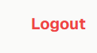
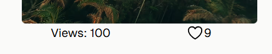
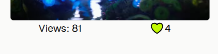
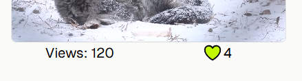
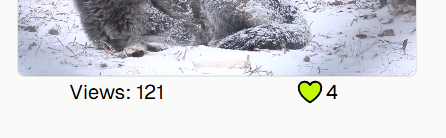
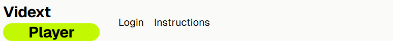
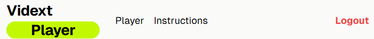
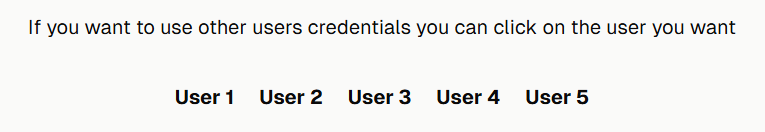
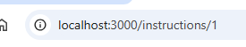
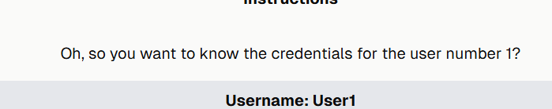

# Vidext Player

This is a technical test for Vidext in which we have a player. We can select from a variety of videos that have view and like counts. The project has a similar style to the website [vidext.io/es](https://vidext.io/es) so I choose the same colors.

## Content 📝
  <ol>
    <li><a href="#stack">Stack</a></li>
    <li><a href="#local-installation">Installation</a></li>
    <li><a href="#endpoints">Endpoints</a></li>
    <li><a href="#problems-solutions">Problems solutions</a></li>
    <li><a href="#future-features">Future features</a></li>
    <li><a href="#development">Development</a></li>
    <li><a href="#contact">Contact</a></li>
  </ol>

## Stack

<div align="center">


</div>


## Local installation

1. Clone the repository
` $ git clone https://github.com/Javi-Gallego/Vidext_video_player.git `
2. Go to root dir
` $ cd Vidext_video_player `
3. Create .env file in root and copy content of .env.example
4. Install dependencies
` $ npm install `
5. Generate migrations
` $ npx prisma migrate dev --name init `
6. Generate prisma client
` $ npx prisma generate`
6. Seed database
` $ npm run seed `
7. Run project
` $ npm run dev `

Credentials
``` js
    "user": "Vidext",
    "password": "123456"
```

To check how db looks like in the browser.
` $ npx prisma studio `

## Endpoints

### Auth Router
- **POST /auth.login**
  - **Description**: Logs in with username and password, and returns a JWT token. Saves some data in the localStorage for session purposes

- **POST /auth.logout**
  - **Description**: Logs out the current user. A log out button appears at the right upper corner once a user is logged. Removes data from localStorage
<center></center>

### Video Like Router
- **POST /videoLike.addLike**
  - **Description**: Adds a like to a video. The like icon is empty and the method adds a new entry on the db
  <center></center>

- **POST /videoLike.removeLike**
  - **Description**: Removes a like from a video. The icon shows you already like the video and now the method invoqued has switched to remove from db
  <center></center>

- **GET /videoLike.getAllLikes**
  - **Description**: Retrieves all likes.

- **GET /videoLike.getLikesByVideo**
  - **Description**: Retrieves the number of likes for each video.

- **GET /videoLike.getLikesByUser**
  - **Description**: Retrieves the likes of a specific user.

### Video Router
- **POST /video.incrementViews**
  - **Description**: Increments the view count of a video. Once you click on any video and starts playing in the player, the view counter changes
  <center></center>
  <center></center>

- **GET /video.getAllVideos**
  - **Description**: Retrieves all videos.

- **GET /video.getVideoById**
  - **Description**: Retrieves a video by its ID.

## Problems solutions
To ensure the like system works correctly, a login feature was added to the page. This allows us to track which user has liked a video and prevents them from liking it again. Instead, clicking the like button again removes the like. This change required modifications to the database, including adding a `users` table, removing the `likes` field from the `videos` table, and adding an intermediate `users-videos` table.

To avoid any person entering the player page, the navbar changes when a user is logged or not

<center></center>
<center></center>

This is not a problem but I did not make use of the dinamic Next router so I used the Instructions page to make a very simple use of it. You can click on the user you want to know the credentials

<center></center>

Each user has an ID and is passed as a parameter to go to the new route

<center></center>

On the the new page we retrieve the parameter and make use of it

<center></center>

## Development:

``` js
 const developer = "Javier Gallego";

 console.log("Desarrollado por: " + developer);
```  

## Contact
<div align="center">
<a href = "mailto:galgar@gmail.com"></a>
<a href="https://www.linkedin.com/in/javier-gallego-dev"></a>
<a href="https://github.com/Javi-Gallego"></a>
</div>